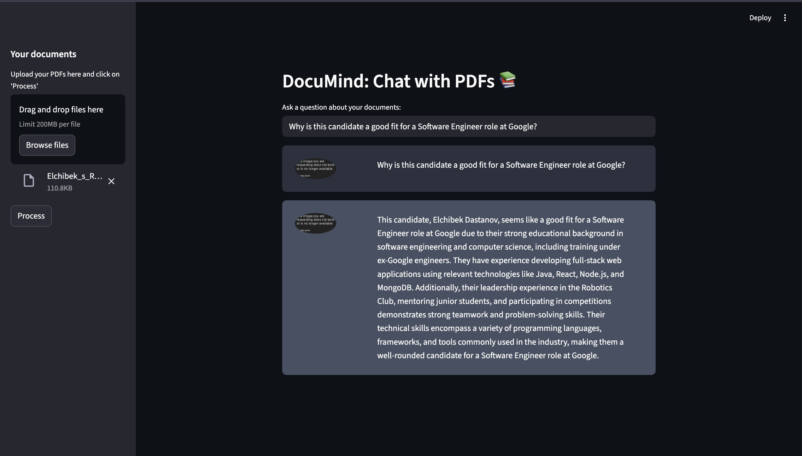

<div align="center">
  <h1>🧠 DocuMind</h1>
  <h3>
    <span style="color: #FF4B4B;">Stop scrolling through 100-page PDFs.</span>
  </h3>
  <p>
    DocuMind uses <strong>Retrieval-Augmented Generation (RAG)</strong> to let you chat with your documents, extracting exact answers with page references in seconds.
  </p>

  
  
  
  
  
  <br>
  <br>

  
  
</div>

---

## 🏗️ System Architecture

DocuMind is not just a wrapper around ChatGPT. It builds a **Vector Search Engine** to ground the AI's responses in your specific data to prevent hallucinations.

```mermaid
graph LR
    A[User PDF] -->|PyPDF2| B(Text Chunks)
    B -->|OpenAI Embeddings| C(Vector Store / FAISS)
    D[User Question] -->|Semantic Search| C
    C -->|Top 3 Matches| E[Context Window]
    E -->|Prompt Engineering| F[GPT-3.5/4]
    F -->|Answer| G[Streamlit UI]
````

1.  **Ingestion:** The app parses raw PDF text and splits it into manageable "chunks" (1000 chars) to preserve context.
2.  **Embedding:** Text chunks are converted into 1536-dimensional vectors using `text-embedding-3-small`.
3.  **Storage:** Vectors are stored locally using **FAISS** (Facebook AI Similarity Search) for O(1) retrieval speed.
4.  **Retrieval:** When a user asks a question, the system finds the most mathematically similar chunks and feeds them to the LLM.

-----

## 🛠️ Tech Stack

| Component | Technology | Description |
| :--- | :--- | :--- |
| **Frontend** | Streamlit | Rapid UI development for data apps |
| **Orchestration** | LangChain | Framework for chaining LLM logic |
| **Vector DB** | FAISS (CPU) | Local, efficient similarity search |
| **LLM** | OpenAI GPT-3.5 | Inference engine for reasoning |
| **Embeddings** | OpenAI Ada | Semantic text representation |

-----

## 💡 Key Features

| Feature | Description |
| :--- | :--- |
| **Multi-Document** | Upload and process multiple PDFs simultaneously. |
| **Context-Aware** | Remembers previous questions in the chat session (Conversation Memory). |
| **Source Truth** | Strictly answers based on the provided context to reduce hallucination. |
| **Secure Design** | API keys are managed via environment variables and never exposed. |

-----

## 🚀 How to Run Locally

**Prerequisites:** Python 3.8+ and an OpenAI API Key.

1.  **Clone the Repository**

    ```bash
    git clone [https://github.com/elchibek5/DocuMind.git](https://github.com/elchibek5/DocuMind.git)
    cd DocuMind
    ```

2.  **Install Dependencies**

    ```bash
    pip install -r requirements.txt
    ```

3.  **Configure Environment**
    Create a `.env` file in the root directory and add your key:

    ```bash
    OPENAI_API_KEY=sk-proj-xxxxxxxxx...
    ```

4.  **Run the App**

    ```bash
    streamlit run app.py
    ```

-----

<div align="center">
  <p>
    Created by <a href="https://linkedin.com/in/elchibekdastanov">Elchibek Dastanov</a>
  </p>
  
</div>